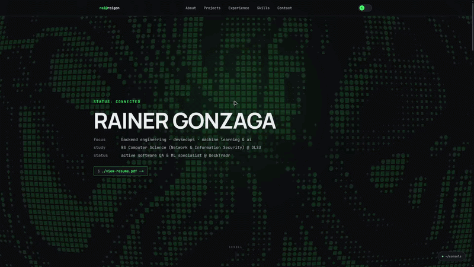

# raigon

My personal website portfolio, built with Next.js, TypeScript, Tailwind CSS, and Framer Motion. Dark mode leans into a phosphor-green CRT terminal look; light mode swaps that for a warm amber-on-paper "ledger" palette. A WebGL digital-rain shader runs behind the page, and an interactive console drawer lets visitors run real commands (`whoami`, `skills`, `projects`, `contact`).

## Features

- **Terminal-themed UI** - CRT green/amber palettes, scanline chrome, decrypt-style text reveals, and a boot-up handshake sequence on load
- **Interactive console drawer** - press `` ` `` to open a real shell with `help`, `whoami`, `skills`, `projects`, `contact`, `sudo`, and command history (↑/↓), lazy-loaded so it doesn't cost anything until opened
- **Manual effects toggle** - visitors can turn off the WebGL background and motion for low-end devices; a jank-watcher nudges people to do this automatically if the page is visibly struggling
- **Reduced-motion ambient background** - a static scanline/glow treatment stands in for the WebGL shader whenever effects are off or `prefers-reduced-motion` is set, so the site still feels alive without the GPU cost
- **Light/dark theme toggle**, remembered across visits
- **Live GitHub activity heatmap**, pulled from the GitHub GraphQL API
- **Scroll progress indicator** in the nav
- **Contact form** wired to Web3Forms, no backend required
- **Dynamically generated Open Graph image** matching the site's own terminal aesthetic for link previews

## Stack

- Next.js (App Router) + TypeScript
- Tailwind CSS v4
- Framer Motion
- OGL, for the WebGL background shader

## Deployment

Deployed on [Vercel](https://vercel.com) at [raigon.dev](https://www.raigon.dev).
